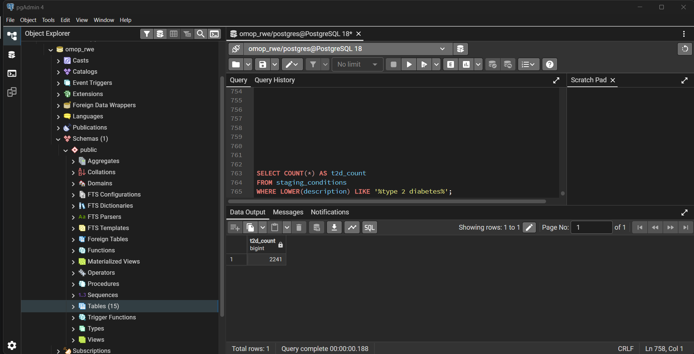
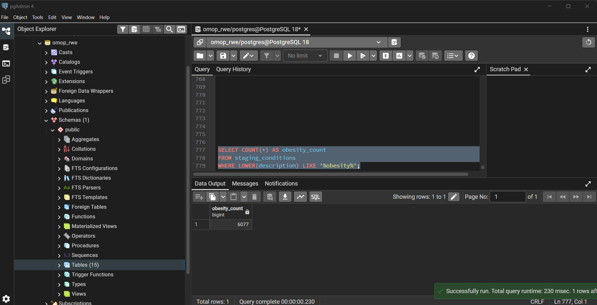
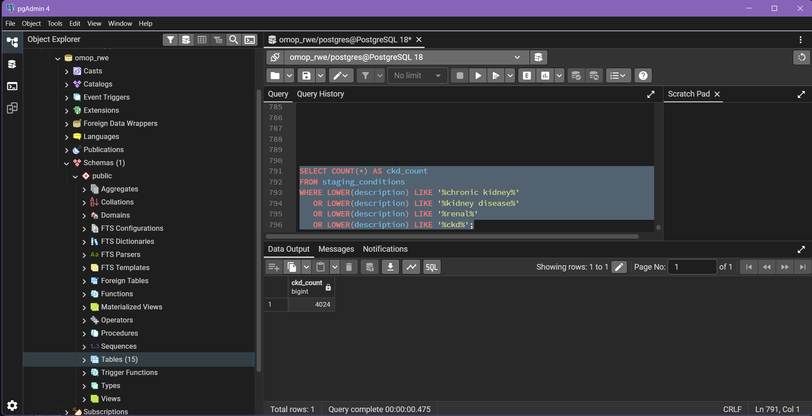
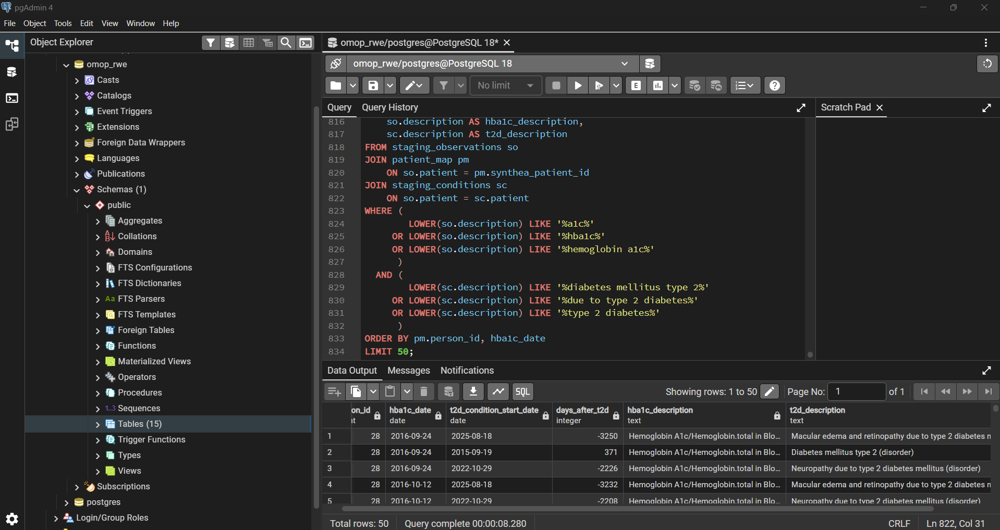
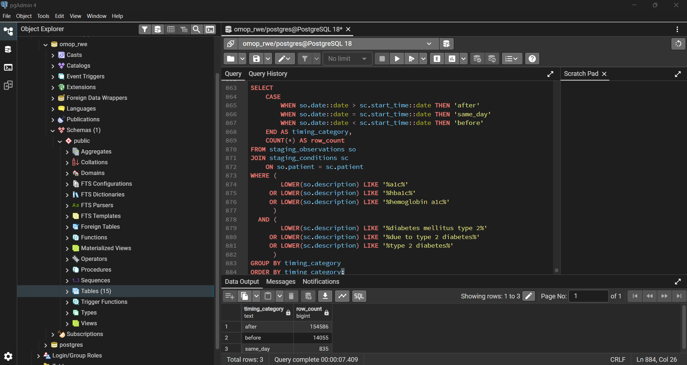

# DB — OMOP Setup (Sprint 1)

**Owner:** Laya Fakher  
**Role:** DB / Synthea / SQL (Critical Path)  
**Database:** PostgreSQL (`omop_rwe`)  
**Data Source:** Synthea (CSV Export)

---

# 🎯 Sprint 1 Objective

The goal of Sprint 1 is to build a complete local data pipeline that:

- generates synthetic healthcare data using Synthea
- loads the data into PostgreSQL
- maps it into OMOP-like tables
- verifies the presence of Type 2 Diabetes (T2D)
- ensures the dataset supports downstream SQL analytics

This work is the **critical path** for the project, as all later components depend on this dataset.

---

# ⚙️ Data Generation

## Command Used

```bash
.\run_synthea.bat -p 10000 --exporter.csv.export=true
````

## Output

Generated **10,000 synthetic patients** with the following CSV files:

* `patients.csv`
* `encounters.csv`
* `conditions.csv`
* `medications.csv`
* `observations.csv`

---

# 🗄️ Database Setup

* PostgreSQL used locally
* Database name: `omop_rwe`
* Managed via pgAdmin
* Schema is a **simplified OMOP-like structure** (not full OMOP CDM)

---

# 🧱 Core Tables

* `person`
* `visit_occurrence`
* `condition_occurrence`
* `drug_exposure`
* `measurement`
* `observation`
* `concept` *(created but not populated in Sprint 1)*

---

# 🔄 ETL Pipeline

## 1. Staging Tables

CSV files are first imported into staging tables:

* `staging_patients`
* `staging_encounters`
* `staging_conditions`
* `staging_medications`
* `staging_observations`

---

## 2. Mapping Tables

Synthea uses UUID identifiers, so mapping tables are required:

* `patient_map` → maps Synthea patient UUID → `person_id`
* `encounter_map` → maps encounter UUID → `visit_occurrence_id`

---

## 3. Data Loading

### Mapping

| CSV              | Target Table              |
| ---------------- | ------------------------- |
| patients.csv     | person                    |
| encounters.csv   | visit_occurrence          |
| conditions.csv   | condition_occurrence      |
| medications.csv  | drug_exposure             |
| observations.csv | measurement / observation |

---

## Observation Handling Logic

The `observations.csv` file contains mixed data:

* numeric values → stored in `measurement`
* non-numeric values → stored in `observation`

This allows support for:

* lab values (HbA1c)
* clinical metrics (BMI)

---

# 🧪 Verification Results

## Core Table Counts

All core tables were successfully populated.

Example:

* `person`  11,540
* `condition_occurrence` 427052
* `drug_exposure` 606120
* `measurement` 5734526
* `observation` 3364109
* `visit_occurrence` 702683
* `concept`  0

---

# 🔍 T2D Verification (TC-11)

## Query:

SELECT COUNT(*)
FROM condition_occurrence
WHERE condition_concept_id = 201826;


## Result


2979


## Interpretation

* T2D mapping is correct
* Data scaled properly from previous smaller runs
* ETL pipeline is functioning as expected

---

# 🧬 Disease Coverage

The dataset was verified to include:

* Type 2 Diabetes ✔
* Obesity ✔
* Hypertension ✔
* Chronic Kidney Disease (CKD) ✔

All were found in `staging_conditions`.

The generated dataset was verified to include all required disease groups for the project: Type 2 Diabetes, Obesity, Hypertension, and Chronic Kidney Disease.





---

# 📊 BMI Analysis

Query results showed:

* description: `Body mass index (BMI) [Ratio]`
* numeric values
* units: `kg/m2`

## Conclusion

BMI is stored in the **`measurement` table**.

---

# 🧪 HbA1c Analysis

Query results showed:

* description: `Hemoglobin A1c/Hemoglobin.total in Blood`
* numeric values
* units: `%`

## Conclusion

HbA1c is stored in the **`measurement` table**.

---

# ⏱️ Temporal Validation

Comparison of HbA1c dates and T2D condition start dates showed:

* HbA1c measurements occur after T2D diagnosis in sampled data
* ordering is clinically reasonable

## Conclusion

The dataset is **temporally valid** for analysis.



---

# 🧠 Concept Table

* `concept` table exists but is empty
* concept IDs are assigned manually (e.g., T2D = 201826)

## Note

Full OMOP vocabulary loading is **out of scope for Sprint 1**.

---

# 🧾 Verification Script

All checks are consolidated in:

`verify_omop.sql`

This script verifies:

* database connection
* staging imports
* mapping tables
* core table counts
* T2D presence (TC-11)
* disease coverage
* BMI and HbA1c inspection
* temporal validation

---

# ✅ Sprint 1 Completion Status

| Requirement                      | Status |
| -------------------------------- | ------ |
| 10,000 patients generated        | ✅      |
| PostgreSQL setup                 | ✅      |
| ETL pipeline working             | ✅      |
| OMOP-like schema populated       | ✅      |
| measurement & observation loaded | ✅      |
| T2D verification (TC-11)         | ✅      |
| Disease coverage verified        | ✅      |
| BMI analysis                     | ✅      |
| HbA1c analysis                   | ✅      |
| Temporal validation              | ✅      |

---

# 🚀 Conclusion

Sprint 1 is **fully complete**.

The database now:

* supports cohort analysis
* contains clinically meaningful data
* scales to required size
* is ready for Sprint 2 SQL development

---

# 🔜 Next Steps (Sprint 2)

* cohort SQL templates
* measurement aggregation (HbA1c, BMI, BP)
* incidence queries
* backend QueryEngine integration


